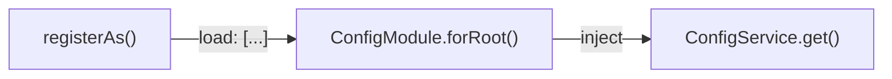

import { Aside } from '@astrojs/starlight/components';

The configuration system gives you a structured, type-safe way to manage application settings in Stratal. It is environment-agnostic — the framework never reads environment variables directly. Instead, your application defines **config namespaces** that extract values from the Cloudflare `Env` object and expose them through a centralized `ConfigService`.

Key capabilities:

- `registerAs()` for creating typed config namespaces with auto-derived DI tokens
- Dot-notation access via `ConfigService` (e.g., `config.get('database.url')`)
- Optional Zod schema validation at startup
- Runtime overrides via `config.set()` for request-scoped values

## How it works

Configuration flows through three steps:

1. **Define** — create config namespaces with `registerAs()`, each receiving the `Env` object and returning a typed config object.
2. **Register** — pass all namespaces to `ConfigModule.forRoot()` in your root or shared module. The module resolves the Cloudflare `Env`, calls each factory, optionally validates the merged result, and initializes `ConfigService`.
3. **Use** — inject `ConfigService` anywhere and access values with dot-notation paths.



## Defining config namespaces

Use `registerAs()` to create a config namespace. The first argument is the namespace name, and the second is a factory function that receives the `Env` object:

```typescript
import { registerAs } from 'stratal/config'

export const databaseConfig = registerAs('database', (env: Env) => ({
  url: env.DATABASE_URL || '',
  maxConnections: parseInt(env.DATABASE_MAX_CONNECTIONS || '10', 10),
}))

export type DatabaseConfig = ReturnType<typeof databaseConfig.factory>
```

The returned object (a `ConfigNamespace`) has these properties:

| Property       | Type                    | Description                                           |
| -------------- | ----------------------- | ----------------------------------------------------- |
| `KEY`          | `Symbol`                | Auto-derived DI token for injecting this namespace     |
| `namespace`    | `string`                | The namespace name passed to `registerAs()`            |
| `factory`      | `(env: Env) => T`       | The factory function that produces the config object   |
| `asProvider()` | `() => Provider`        | Returns a provider definition for module registration  |

Here is a second namespace for email settings:

```typescript
import { registerAs } from 'stratal/config'

export const emailConfig = registerAs('email', (env: Env) => ({
  provider: env.EMAIL_PROVIDER || 'mailchannels',
  from: {
    name: env.EMAIL_FROM_NAME || 'App',
    email: env.EMAIL_FROM_ADDRESS || 'noreply@example.com',
  },
  queue: env.EMAIL_QUEUE,
}))

export type EmailConfig = ReturnType<typeof emailConfig.factory>
```

<Aside type="tip">
  Co-locate all config namespaces in a `src/config/` directory with a barrel export (`index.ts`). This keeps configuration centralized and makes it easy to pass all namespaces to `ConfigModule.forRoot()`.
</Aside>

## Registering configuration

Import `ConfigModule` in your root module (or a shared `CoreModule`) and call `forRoot()` with your namespaces:

```typescript
import { Module } from 'stratal'
import { ConfigModule } from 'stratal/config'
import { databaseConfig, emailConfig, storageConfig } from '../config'

@Module({
  imports: [
    ConfigModule.forRoot({
      load: [databaseConfig, emailConfig, storageConfig],
      validateSchema: AppConfigSchema, // Optional Zod schema
    }),
  ],
})
export class CoreModule {}
```

`ConfigModule.forRoot()` accepts a `ConfigModuleOptions` object:

| Property         | Type                | Required | Description                                             |
| ---------------- | ------------------- | -------- | ------------------------------------------------------- |
| `load`           | `ConfigNamespace[]` | Yes      | Array of config namespaces to register                  |
| `validateSchema` | `ZodSchema`         | No       | A Zod schema to validate the merged config at startup   |

<Aside type="note">
  Import `ConfigModule.forRoot()` once in your root module or a shared `CoreModule`. Child feature modules do not need to import it — they can inject `ConfigService` directly since it is registered in the global DI container.
</Aside>

## Injecting and using ConfigService

Inject `ConfigService` into any provider using `CONFIG_TOKENS.ConfigService`:

```typescript
import { inject } from 'tsyringe'
import { Transient, CONFIG_TOKENS, type IConfigService } from 'stratal'

@Transient()
export class MyService {
  constructor(
    @inject(CONFIG_TOKENS.ConfigService)
    private readonly config: IConfigService
  ) {}

  getConnectionUrl(): string {
    return this.config.get('database.url')
  }
}
```

The `IConfigService` interface provides these methods:

| Method                    | Return type        | Description                                                  |
| ------------------------- | ------------------ | ------------------------------------------------------------ |
| `get(path)`               | `T`                | Get a value using dot-notation (e.g., `'email.from.name'`)  |
| `set(path, value)`        | `void`             | Override a value at runtime                                  |
| `reset(path?)`            | `void`             | Reset a specific path or the entire config to original values |
| `has(path)`               | `boolean`          | Check whether a config path exists                           |
| `all()`                   | `Readonly<T>`      | Get the entire merged config object                          |

```typescript
// Read nested values with dot notation
const fromName = this.config.get('email.from.name')

// Check before accessing
if (this.config.has('database.url')) {
  const url = this.config.get('database.url')
}
```

<Aside type="tip">
  Prefer `ConfigService` over `@inject(myConfig.KEY)` for runtime access. Direct namespace injection (`@inject(myConfig.KEY)`) is intended for `forRootAsync` patterns where static config is needed during module initialization. `ConfigService` supports runtime overrides and provides a unified access point for all namespaces.
</Aside>

## Type safety with ModuleConfig

To get autocompletion and type checking on `config.get()` paths, augment the `ModuleConfig` interface using TypeScript module augmentation:

```typescript
// src/config/types.ts
import type { DatabaseConfig } from './database.config'
import type { EmailConfig } from './email.config'

declare module 'stratal' {
  interface ModuleConfig {
    database: DatabaseConfig
    email: EmailConfig
  }
}
```

After this augmentation, `config.get('database.url')` is fully typed — your editor will autocomplete valid paths and flag invalid ones at compile time.

## Schema validation

Pass a Zod schema to `validateSchema` to validate the merged config object at startup. If validation fails, Stratal throws a `ConfigValidationError` before the application starts:

```typescript
import { z } from 'zod'

export const AppConfigSchema = z.object({
  database: z.object({
    url: z.string().min(1),
    maxConnections: z.number().positive(),
  }),
  email: z.object({
    provider: z.string(),
    from: z.object({
      name: z.string(),
      email: z.string().email(),
    }),
  }),
})
```

```typescript
import { ConfigModule } from 'stratal/config'
import { AppConfigSchema } from '../config/app-config.schema'

ConfigModule.forRoot({
  load: [databaseConfig, emailConfig],
  validateSchema: AppConfigSchema,
})
```

If required environment variables are missing or have the wrong type, the application fails fast with a clear error:

```
ConfigValidationError: Configuration validation failed
```

<Aside type="caution">
  Schema validation only runs at startup when `ConfigModule.forRoot()` initializes. Values set later via `config.set()` are **not** re-validated against the schema.
</Aside>

## Runtime overrides

Use `config.set()` to override config values during a request. This is useful for middleware that adjusts settings based on request context:

```typescript
// In middleware — override for this request
async handle(ctx: RouterContext, next: () => Promise<void>) {
  this.config.set('email.from.name', 'Custom Name')
  await next()
}

// In a downstream service — reflects the override
async sendEmail() {
  const fromName = this.config.get('email.from.name') // 'Custom Name'
}
```

To restore original values, call `reset()`:

```typescript
// Reset a specific path
this.config.reset('email.from.name')

// Reset the entire config
this.config.reset()
```

## Feeding config to other modules

Framework modules like `StorageModule` and `EmailModule` use `forRootAsync` to receive their options from config namespaces. Pass the namespace's `KEY` token in the `inject` array:

```typescript
import { Module } from 'stratal'
import { ConfigModule } from 'stratal/config'
import { StorageModule } from 'stratal/storage'
import { EmailModule } from 'stratal/email'
import { databaseConfig, emailConfig, storageConfig } from '../config'

@Module({
  imports: [
    ConfigModule.forRoot({
      load: [databaseConfig, emailConfig, storageConfig],
    }),

    StorageModule.forRootAsync({
      inject: [storageConfig.KEY],
      useFactory: (storage) => ({
        storage: storage.storage,
        defaultStorageDisk: storage.defaultStorageDisk,
      }),
    }),

    EmailModule.forRootAsync({
      inject: [emailConfig.KEY],
      useFactory: (email) => ({
        provider: email.provider,
        from: email.from,
        queue: email.queue,
      }),
    }),
  ],
})
export class CoreModule {}
```

<Aside type="note">
  Use direct namespace injection (`@inject(myConfig.KEY)`) in `forRootAsync` patterns where you need static config during module initialization. For runtime access in services and controllers, use `ConfigService` instead.
</Aside>

## Custom config services

For application-specific helpers like `isDevelopment()`, create a wrapper service around `ConfigService`:

```typescript
import { inject } from 'tsyringe'
import { Transient, CONFIG_TOKENS, type IConfigService } from 'stratal'

@Transient()
export class AppConfigService {
  constructor(
    @inject(CONFIG_TOKENS.ConfigService)
    private readonly config: IConfigService
  ) {}

  isDevelopment(): boolean {
    return this.config.get('app.environment') === 'development'
  }

  getApiBaseUrl(): string {
    return this.config.get('app.apiBaseUrl')
  }
}
```

Register `AppConfigService` as a provider in your module and inject it wherever you need the convenience methods.

## Adding new configuration

To add a new config namespace to your application:

1. **Create the namespace file**

   ```typescript
   // src/config/new-feature.config.ts
   import { registerAs } from 'stratal/config'

   export const newFeatureConfig = registerAs('newFeature', (env: Env) => ({
     apiKey: env.NEW_FEATURE_API_KEY || '',
     enabled: env.NEW_FEATURE_ENABLED === 'true',
     timeout: parseInt(env.NEW_FEATURE_TIMEOUT || '5000', 10),
   }))

   export type NewFeatureConfig = ReturnType<typeof newFeatureConfig.factory>
   ```

2. **Add to your barrel export**

   ```typescript
   // src/config/index.ts
   export * from './new-feature.config'

   export const allConfigs = [
     // ... existing configs
     newFeatureConfig,
   ]
   ```

3. **Add a Zod schema** (optional)

   ```typescript
   // src/config/app-config.schema.ts
   export const AppConfigSchema = z.object({
     // ... existing schemas
     newFeature: z.object({
       apiKey: z.string(),
       enabled: z.boolean(),
       timeout: z.number(),
     }),
   })
   ```

4. **Set environment variables** — add to `.dev.vars.example` for local development and set in production via `wrangler secret put` (sensitive) or `wrangler.jsonc` (non-sensitive).

## Testing

Use `ConfigModule.forRoot()` inside `Test.createTestingModule` to load config in tests:

```typescript
import { Test, type TestingModule } from '@stratal/testing'
import { CONFIG_TOKENS, type IConfigService } from 'stratal'
import { ConfigModule } from 'stratal/config'
import { databaseConfig, emailConfig } from '../config'

describe('MyService', () => {
  let module: TestingModule

  beforeAll(async () => {
    module = await Test.createTestingModule({
      imports: [
        ConfigModule.forRoot({
          load: [databaseConfig, emailConfig],
        }),
      ],
    }).compile()
  })

  it('should resolve config values', () => {
    const config = module.get<IConfigService>(CONFIG_TOKENS.ConfigService)
    expect(config.get('database.url')).toBeDefined()
  })
})
```

For more on testing patterns, see the [Testing Overview](/testing/overview/).

## Troubleshooting

### ConfigValidationError at startup

```
ConfigValidationError: Configuration validation failed
```

Check that all required environment variables are set and match the Zod schema types. Missing or incorrectly typed variables will cause validation to fail.

### Type errors with config paths

```
Argument of type '"invalid.path"' is not assignable
```

Verify that you are using the correct dot-notation path matching your namespace structure, and that your `ModuleConfig` augmentation includes the namespace. For example, if your namespace defines `{ database: { url: string } }`, the valid path is `'database.url'`.

### ConfigService not initialized

```
Error: ConfigService not initialized
```

Ensure `ConfigModule.forRoot()` is imported in your module chain. The root module or a shared `CoreModule` must include it in its `imports` array.

## Next steps

- [Modules](/core-concepts/modules/) to learn how modules are structured and composed.
- [Providers](/core-concepts/providers/) for all the ways you can register services.
- [Environment Typing](/guides/environment-typing/) to type the `Env` object that config factories receive.
- [Testing Overview](/testing/overview/) for testing strategies with configuration.
