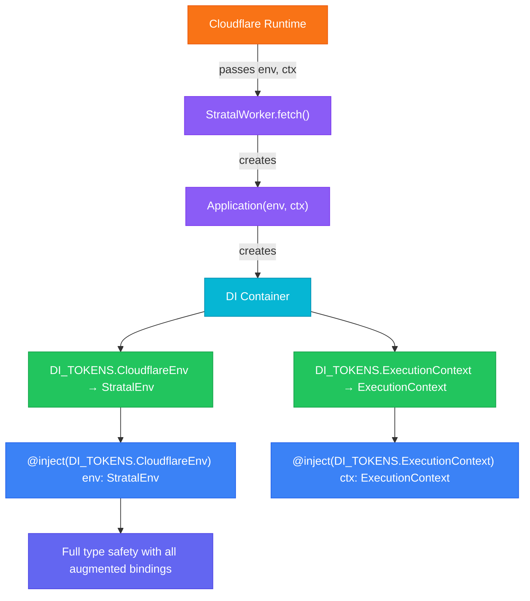

import { Aside, Tabs, TabItem } from '@astrojs/starlight/components';

Cloudflare Workers receive environment bindings (KV namespaces, D1 databases, R2 buckets, queues, secrets, and more) at runtime. Stratal provides a typed `StratalEnv` interface so these bindings are type-safe throughout your application, from the worker entry point all the way down to individual services.

## The StratalEnv interface

Stratal defines a base interface with two required bindings:

```typescript
interface StratalEnv {
  ENVIRONMENT: string
  CACHE: KVNamespace
}
```

| Binding       | Type          | Description                                         |
| ------------- | ------------- | --------------------------------------------------- |
| `ENVIRONMENT` | `string`      | The current environment name (e.g., `development`, `production`) |
| `CACHE`       | `KVNamespace` | A KV namespace used by the built-in caching system  |

Your application will almost certainly need more bindings than this. You extend `StratalEnv` using TypeScript module augmentation.

## Adding custom bindings (recommended)

The recommended approach is to auto-generate your binding types from your Wrangler configuration (`wrangler.toml` or `wrangler.jsonc`) using the Wrangler CLI, then extend them in your `StratalEnv` declaration.

### Step 1: Generate types from your Wrangler config

Run the Wrangler CLI to generate a `worker-configuration.d.ts` file in your project root:

```bash
npx wrangler types
```

This reads your Wrangler configuration file and generates an interface with all your bindings:

```typescript
// worker-configuration.d.ts (auto-generated)
declare namespace Cloudflare {
  interface Env {
    ENVIRONMENT: string
    JWT_SECRET: string
    CACHE: KVNamespace
    DATABASE: D1Database
    STORAGE_BUCKET: R2Bucket
    NOTIFICATIONS_QUEUE: Queue
  }
}
```

<Aside type="tip">
  Add `npx wrangler types` to your build script or a pre-build hook so the types stay in sync with your Wrangler configuration (`wrangler.toml` or `wrangler.jsonc`). You can also add `worker-configuration.d.ts` to `.gitignore` if you prefer generating it fresh in CI.
</Aside>

### Step 2: Extend StratalEnv from the generated types

Use module augmentation to make `StratalEnv` extend the generated `Cloudflare.Env` interface:

```typescript
// src/types/env.ts
export {}

declare module 'stratal' {
  interface StratalEnv extends Cloudflare.Env {}
}
```

This pulls in every binding from `worker-configuration.d.ts` automatically. When you add a new binding to your Wrangler config and re-run `npx wrangler types`, your `StratalEnv` picks it up without any manual changes.

Import the declaration file early in your worker entry point:

```typescript
// src/index.ts
import 'reflect-metadata'
import './types/env'
import { StratalWorker } from 'stratal/worker'
import { AppModule } from './app.module'

export default class Worker extends StratalWorker {
  protected configure() {
    return { module: AppModule }
  }
}
```

After this, every service that injects `StratalEnv` gets full autocompletion and type checking for all bindings defined in your Wrangler configuration.

### Manual augmentation

If you have bindings that are not defined in your Wrangler configuration (for example, bindings injected at deploy time or via secrets), you can still declare them manually:

```typescript
// src/types/env.ts
export {}

declare module 'stratal' {
  interface StratalEnv extends Cloudflare.Env {
    // Bindings not in wrangler.toml
    DEPLOY_SHA: string
    FEATURE_FLAGS: KVNamespace
  }
}
```

<Aside type="note">
  The `export {}` at the top of the declaration file is required. It tells TypeScript to treat the file as a module, which is necessary for `declare module` to perform module augmentation rather than creating a new ambient module declaration.
</Aside>

## How it works

TypeScript module augmentation merges your custom bindings into the base `StratalEnv` interface. After augmentation, the effective type becomes:

```typescript
interface StratalEnv {
  // From stratal core
  ENVIRONMENT: string
  CACHE: KVNamespace

  // From your declaration
  DATABASE: D1Database
  STORAGE_BUCKET: R2Bucket
  NOTIFICATIONS_QUEUE: Queue
  JWT_SECRET: string
}
```

This merged type is used everywhere: the DI container, the Hono router bindings, and any service that injects the environment.

## Injecting the environment

Use `DI_TOKENS.CloudflareEnv` to inject the typed environment into any service:

```typescript
import { Transient, inject, DI_TOKENS } from 'stratal/di'
import type { StratalEnv } from 'stratal'

@Transient()
export class StorageService {
  private readonly bucket: R2Bucket

  constructor(
    @inject(DI_TOKENS.CloudflareEnv) private readonly env: StratalEnv,
  ) {
    this.bucket = env.STORAGE_BUCKET // fully typed
  }

  async upload(key: string, data: ReadableStream): Promise<void> {
    await this.bucket.put(key, data)
  }
}
```

The environment is registered as a singleton value in the global DI container. It is available in every scope (singleton, transient, and request-scoped).

## Injecting the ExecutionContext

Cloudflare's `ExecutionContext` is also available through DI. This is useful for `waitUntil` calls or other runtime APIs:

```typescript
import { Transient, inject, DI_TOKENS } from 'stratal/di'

@Transient()
export class BackgroundTaskService {
  constructor(
    @inject(DI_TOKENS.ExecutionContext) private readonly ctx: ExecutionContext,
  ) {}

  runInBackground(task: Promise<void>): void {
    this.ctx.waitUntil(task)
  }
}
```

## Typing queue bindings

When using queues, you need to augment the `QueueNames` interface so the queue system knows which queues exist. You can derive queue names directly from your environment bindings using TypeScript utility types:

```typescript
// src/types/queues.ts
export {}

/** Extract only the queue binding keys from Cloudflare.Env */
type QueueBindingKeys = {
  [K in keyof Cloudflare.Env]: Cloudflare.Env[K] extends Queue ? K : never
}[keyof Cloudflare.Env]

/** Convert a binding name like NOTIFICATIONS_QUEUE to kebab-case: notifications-queue */
type BindingToQueueName<T extends string> =
  T extends `${infer Part}_${infer Rest}`
    ? `${Lowercase<Part>}-${BindingToQueueName<Rest>}`
    : Lowercase<T>

/** Derive all queue names from Cloudflare.Env bindings */
type DerivedQueueNames = BindingToQueueName<QueueBindingKeys>

declare module 'stratal' {
  interface QueueNames extends Record<DerivedQueueNames, true> {}
}
```

This derives queue names from your `Cloudflare.Env` bindings automatically. A binding named `NOTIFICATIONS_QUEUE` produces the queue name `notifications-queue`. A binding named `ORDER_EVENTS_QUEUE` produces `order-events-queue`.

The queue provider performs the reverse conversion at runtime: it takes a queue name like `notifications-queue`, converts it to `NOTIFICATIONS_QUEUE` via `.toUpperCase().replace(/-/g, '_')`, and looks up the binding in the environment.

<Aside type="tip">
  By deriving queue names from `Cloudflare.Env`, you only need to maintain bindings in one place. When you add a new queue binding to your Wrangler config and re-run `npx wrangler types`, the queue name is automatically available.
</Aside>

## Matching your Wrangler config

Your Wrangler configuration file (`wrangler.toml` or `wrangler.jsonc`) is the source of truth for bindings. Running `npx wrangler types` keeps your types in sync:

<Tabs>
  <TabItem label="wrangler.toml">
```toml
[vars]
ENVIRONMENT = "development"
JWT_SECRET = "dev-secret"

[[kv_namespaces]]
binding = "CACHE"
id = "abc123"

[[d1_databases]]
binding = "DATABASE"
database_name = "my-app"
database_id = "def456"

[[r2_buckets]]
binding = "STORAGE_BUCKET"
bucket_name = "uploads"

[[queues.producers]]
binding = "NOTIFICATIONS_QUEUE"
queue = "notifications"
```
  </TabItem>
  <TabItem label="wrangler.jsonc">
```jsonc
{
  "name": "my-app",
  "main": "src/index.ts",
  "compatibility_date": "2026-02-25",
  "compatibility_flags": ["nodejs_compat"],
  "vars": {
    "ENVIRONMENT": "development",
    "JWT_SECRET": "dev-secret"
  },
  "kv_namespaces": [
    { "binding": "CACHE", "id": "abc123" }
  ],
  "d1_databases": [
    { "binding": "DATABASE", "database_name": "my-app", "database_id": "def456" }
  ],
  "r2_buckets": [
    { "binding": "STORAGE_BUCKET", "bucket_name": "uploads" }
  ],
  "queues": {
    "producers": [
      { "binding": "NOTIFICATIONS_QUEUE", "queue": "notifications" }
    ]
  }
}
```
  </TabItem>
  <TabItem label="npx wrangler types">
```typescript
// worker-configuration.d.ts (auto-generated)
declare namespace Cloudflare {
  interface Env {
    ENVIRONMENT: string
    JWT_SECRET: string
    CACHE: KVNamespace
    DATABASE: D1Database
    STORAGE_BUCKET: R2Bucket
    NOTIFICATIONS_QUEUE: Queue
  }
}
```
  </TabItem>
  <TabItem label="src/types/env.ts">
```typescript
export {}

declare module 'stratal' {
  interface StratalEnv extends Cloudflare.Env {}
}
```
  </TabItem>
</Tabs>

When you add or remove a binding in your Wrangler configuration, re-run `npx wrangler types` to regenerate the `Cloudflare.Env` interface. Your `StratalEnv` declaration picks up the changes automatically.

## Organizing type declarations

For larger projects, split your type declarations by feature:

```
src/
  types/
    env.ts          # Core bindings (DATABASE, secrets)
    queues.ts       # Queue names and bindings
    storage.ts      # R2 and KV bindings
```

Import all of them in your worker entry point:

```typescript
// src/index.ts
import 'reflect-metadata'
import './types/env'
import './types/queues'
import './types/storage'
import { StratalWorker } from 'stratal/worker'
import { AppModule } from './app.module'

export default class Worker extends StratalWorker {
  protected configure() {
    return { module: AppModule }
  }
}
```

<Aside type="caution">
  Make sure every type declaration file is imported before `StratalWorker` runs. If a file is not imported, its augmented types will not be visible to the rest of the application.
</Aside>

## The type flow

Here is how the environment flows from the Cloudflare runtime to your services:



## Next steps

- [Dependency Injection](/core-concepts/dependency-injection/) for more on tokens and scopes.
- [Caching](/integrations/caching/) to see how the `CACHE` KV binding is used.
- [Queues](/integrations/queues/) for setting up queue producers and consumers.
- [Storage](/integrations/storage/) for working with R2 buckets.
