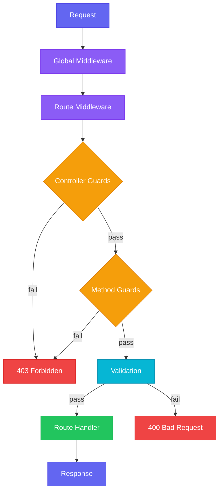

import { Aside } from '@astrojs/starlight/components';

Guards determine whether a request should be allowed to proceed to the route handler. They run after middleware but before the handler, making them the right place for authentication checks, role verification, and other access control logic.

## The CanActivate interface

Every guard implements the `CanActivate` interface with a single method:

```typescript
import { CanActivate, RouterContext } from 'stratal'

export class AuthGuard implements CanActivate {
  canActivate(context: RouterContext): boolean | Promise<boolean> {
    const token = context.header('Authorization')
    return token !== undefined
  }
}
```

Return `true` to let the request through or `false` to block it. When a guard returns `false`, Stratal responds with `403 Forbidden` and the route handler never executes.

The method can be synchronous or asynchronous. Use `async` when you need to look up a token, query a database, or call an external service.

## Applying guards with @UseGuards

The `@UseGuards` decorator attaches guards to controllers or individual methods. It accepts one or more guard classes or guard instances.

### Controller-level guards

Apply a guard to every route in a controller:

```typescript
import { Controller, IController, UseGuards, Route, RouterContext } from 'stratal'
import { z } from 'stratal/validation'
import { AuthGuard } from './auth.guard'

@Controller('/api/orders')
@UseGuards(AuthGuard)
export class OrdersController implements IController {
  @Route({ response: orderListSchema })
  index(ctx: RouterContext) {
    // AuthGuard must pass before this runs
    return ctx.json({ orders: [] })
  }

  @Route({ params: z.object({ id: z.string() }), response: orderSchema })
  show(ctx: RouterContext) {
    // AuthGuard also runs before this
    const id = ctx.param('id')
    return ctx.json({ order: { id } })
  }
}
```

### Method-level guards

Apply a guard to a single route method:

```typescript
@Controller('/api/orders')
@UseGuards(AuthGuard)
export class OrdersController implements IController {
  @Route({ response: orderListSchema })
  index(ctx: RouterContext) {
    // Only AuthGuard runs
    return ctx.json({ orders: [] })
  }

  @UseGuards(AdminGuard)
  @Route({ response: orderSchema })
  destroy(ctx: RouterContext) {
    // AuthGuard runs first, then AdminGuard
    const id = ctx.param('id')
    // ...
  }
}
```

Controller-level guards always run first, followed by method-level guards. In the example above, `destroy` is protected by both `AuthGuard` and `AdminGuard`, while `index` only requires `AuthGuard`.

## Guard execution order

Guards run sequentially in the order they are listed. If any guard returns `false`, execution stops immediately and the remaining guards are skipped.

```typescript
@UseGuards(AuthGuard, RateLimitGuard, TenantGuard)
export class SecureController implements IController {
  // Execution: AuthGuard -> RateLimitGuard -> TenantGuard -> handler
  // If AuthGuard returns false, RateLimitGuard and TenantGuard never run
}
```

The full request lifecycle with guards looks like this:



## Dependency injection in guards

Guard classes are resolved from the request-scoped DI container. This means you can inject services into your guards just like any other provider:

```typescript
import { CanActivate, RouterContext, Transient, inject, DI_TOKENS } from 'stratal'
import type { StratalEnv } from 'stratal'

@Transient()
export class ApiKeyGuard implements CanActivate {
  constructor(
    @inject(DI_TOKENS.CloudflareEnv) private readonly env: StratalEnv,
  ) {}

  canActivate(context: RouterContext): boolean {
    const apiKey = context.header('X-API-Key')
    return apiKey === this.env.API_SECRET
  }
}
```

<Aside type="note">
  Guards must be registered as providers in your module (or use the `@Transient()` decorator) so the DI container knows how to create them. If a guard has no dependencies, you can skip the decorator since Stratal will still resolve the class.
</Aside>

## Guard factories

Sometimes you need to configure a guard with options at decoration time. A guard factory is a function that returns a guard instance:

```typescript
import { CanActivate, RouterContext } from 'stratal'

function RoleGuard(...roles: string[]): CanActivate {
  return {
    canActivate(context: RouterContext): boolean {
      const container = context.getContainer()
      const authContext = container.resolve(AuthContext)
      const userRoles = authContext.getRoles()
      return roles.some((role) => userRoles.includes(role))
    },
  }
}
```

Use it with `@UseGuards` by calling the factory:

```typescript
@Controller('/api/admin')
@UseGuards(RoleGuard('admin', 'super-admin'))
export class AdminController implements IController {
  // Only users with 'admin' or 'super-admin' role can access these routes
}
```

Guard instances (objects with a `canActivate` method) are used directly, while guard classes are resolved from the DI container.

<Aside type="tip">
  Guard factories are useful when the same guard logic needs different configuration per controller or method. For example, a `RoleGuard` that checks different roles depending on the endpoint.
</Aside>

## Writing an authentication guard

Here is a more complete authentication guard that validates a JWT and sets the auth context for downstream services:

```typescript
import { CanActivate, RouterContext, Transient, inject, DI_TOKENS } from 'stratal'

@Transient()
export class AuthGuard implements CanActivate {
  constructor(
    @inject(TokenService) private readonly tokenService: TokenService,
  ) {}

  async canActivate(context: RouterContext): Promise<boolean> {
    const header = context.header('Authorization')
    if (!header?.startsWith('Bearer ')) {
      return false
    }

    const token = header.slice(7)
    const payload = await this.tokenService.verify(token)

    if (!payload) {
      return false
    }

    // Store the authenticated user in the request container
    // so other services can access it
    const container = context.getContainer()
    container.registerValue(DI_TOKENS.AuthContext, {
      userId: payload.sub,
      roles: payload.roles,
    })

    return true
  }
}
```

Services downstream can then inject `DI_TOKENS.AuthContext` to access the authenticated user without repeating the token logic.

## Writing a permission guard

Building on the authentication guard, a permission guard checks whether the authenticated user has the required scopes:

```typescript
import { CanActivate, RouterContext } from 'stratal'

function PermissionGuard(...requiredScopes: string[]): CanActivate {
  return {
    canActivate(context: RouterContext): boolean {
      const container = context.getContainer()
      const auth = container.resolve(DI_TOKENS.AuthContext)

      if (!auth) {
        return false
      }

      return requiredScopes.every((scope) => auth.scopes?.includes(scope))
    },
  }
}
```

Combine it with `AuthGuard` on a controller:

```typescript
@Controller('/api/students')
@UseGuards(AuthGuard)
export class StudentsController implements IController {
  @Route({ response: studentListSchema })
  index(ctx: RouterContext) {
    // Auth only, no specific permissions needed
  }

  @UseGuards(PermissionGuard('students:create'))
  @Route({ body: createStudentSchema, response: studentSchema })
  async create(ctx: RouterContext) {
    // Requires authentication AND 'students:create' permission
  }

  @UseGuards(PermissionGuard('students:delete'))
  @Route({ params: z.object({ id: z.string() }), response: studentSchema })
  destroy(ctx: RouterContext) {
    // Requires authentication AND 'students:delete' permission
  }
}
```

## Multiple guards

You can stack as many guards as you need. They all must pass for the request to proceed:

```typescript
@Controller('/api/billing')
@UseGuards(AuthGuard, TenantGuard, RateLimitGuard)
export class BillingController implements IController {
  @UseGuards(PermissionGuard('billing:write'))
  @Route({ body: chargeSchema, response: chargeResponseSchema })
  async create(ctx: RouterContext) {
    // Must pass: AuthGuard, TenantGuard, RateLimitGuard, PermissionGuard
  }
}
```

## OpenAPI security

When guards are present on a route, Stratal automatically adds security scheme metadata to the OpenAPI specification. You can also set security schemes explicitly using the `security` option on `@Controller` or `@Route`:

```typescript
@Controller('/api/users', {
  tags: ['Users'],
  security: ['bearerAuth'],
})
export class UsersController implements IController {
  // All routes show bearerAuth in the OpenAPI spec
}
```

## Next steps

- [Middleware](/guides/middleware/) to learn about running logic before guards.
- [Error Handling](/guides/error-handling/) to customize the response when a guard fails.
- [Dependency Injection](/core-concepts/dependency-injection/) for more on injecting services into guards.
